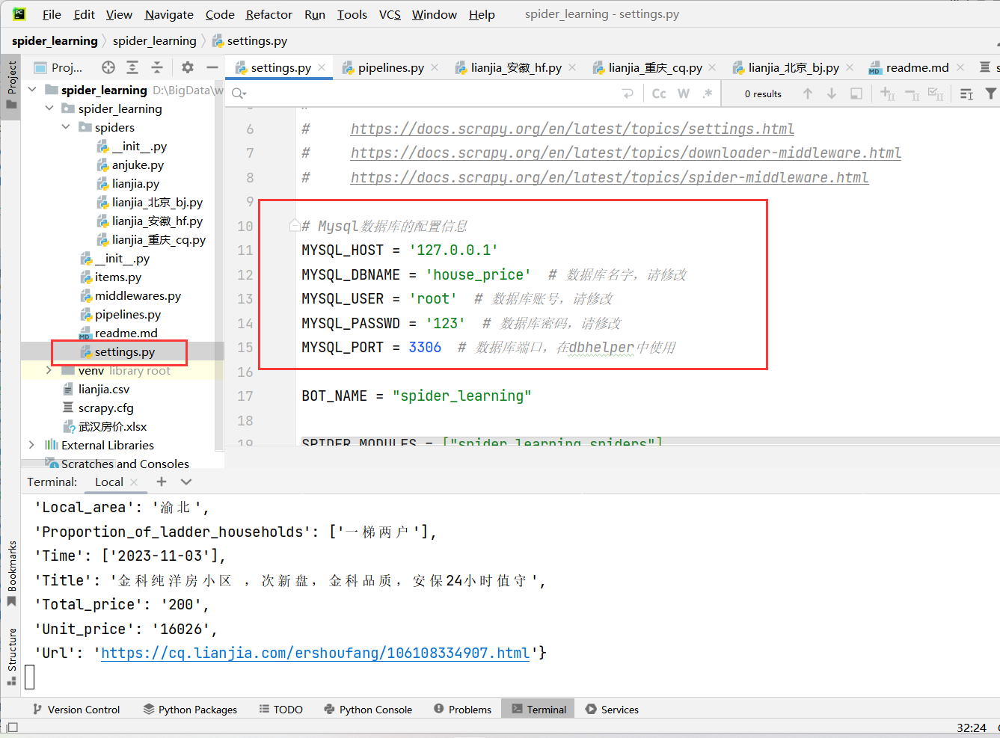
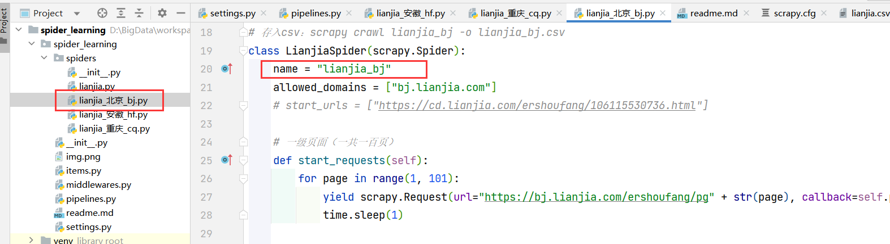
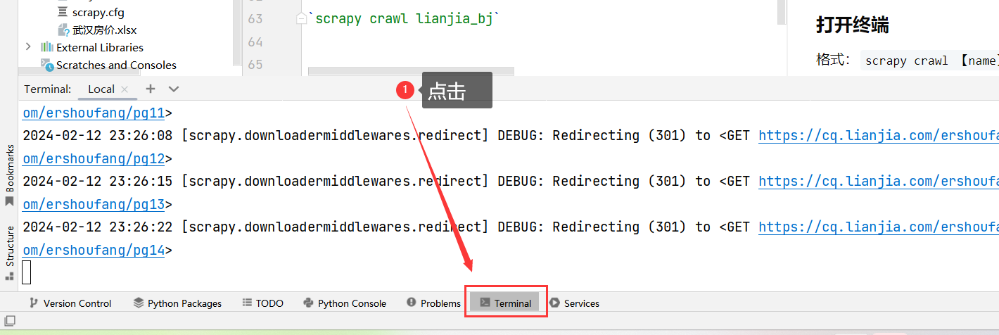
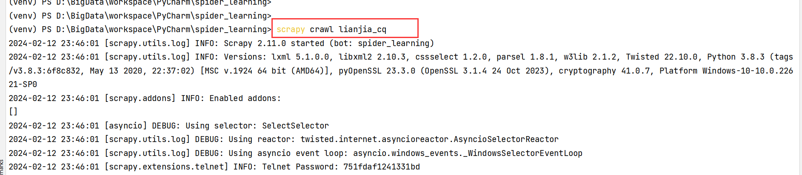
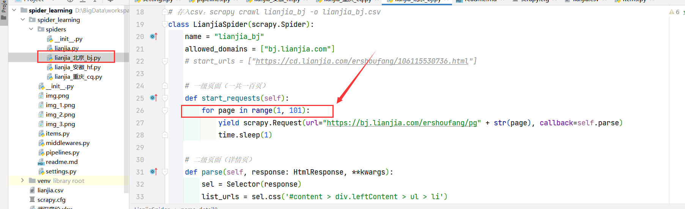
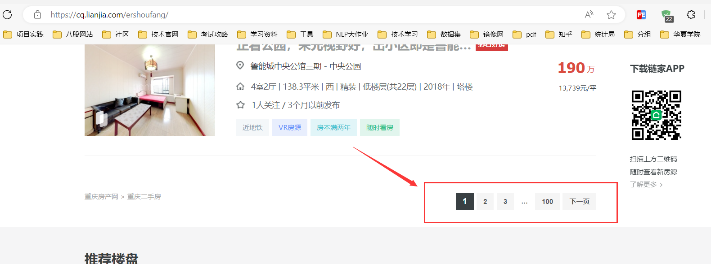
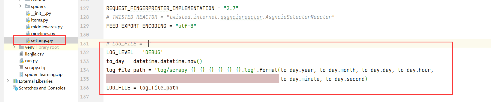

# 文件用途

spiders文件夹：爬虫文件

items:设置字段名

middlewares.py:中间件

pipelines.py：管道

settings.py：配置文件

run.py：启动多个爬虫

# 数据库设置：

### 创建名为house_price的数据库



## 建表语句
运行 建表
```
-- 北京
-- ----------------------------
DROP TABLE IF EXISTS `bj_price`;
CREATE TABLE `bj_price`  (
  `Building_orientation` varchar(255) CHARACTER SET utf8mb4 COLLATE utf8mb4_0900_ai_ci NULL DEFAULT NULL COMMENT '房屋朝向',
  `Building_structure` varchar(255) CHARACTER SET utf8mb4 COLLATE utf8mb4_0900_ai_ci NULL DEFAULT NULL COMMENT '建筑结构',
  `Building_type` varchar(255) CHARACTER SET utf8mb4 COLLATE utf8mb4_0900_ai_ci NULL DEFAULT NULL COMMENT '建筑类型',
  `Cell_name` varchar(255) CHARACTER SET utf8mb4 COLLATE utf8mb4_0900_ai_ci NULL DEFAULT NULL COMMENT '小区名称',
  `Decoration_condition` varchar(255) CHARACTER SET utf8mb4 COLLATE utf8mb4_0900_ai_ci NULL DEFAULT NULL COMMENT '装修情况',
  `Equipped_with_elevator` varchar(255) CHARACTER SET utf8mb4 COLLATE utf8mb4_0900_ai_ci NULL DEFAULT NULL COMMENT '配备电梯',
  `Floor_area` varchar(255) CHARACTER SET utf8mb4 COLLATE utf8mb4_0900_ai_ci NULL DEFAULT NULL COMMENT '建筑面积',
  `Floor_height` varchar(255) CHARACTER SET utf8mb4 COLLATE utf8mb4_0900_ai_ci NULL DEFAULT NULL COMMENT '楼层高度',
  `House_type_structure` varchar(255) CHARACTER SET utf8mb4 COLLATE utf8mb4_0900_ai_ci NULL DEFAULT NULL COMMENT '户型结构',
  `Housing_type` varchar(255) CHARACTER SET utf8mb4 COLLATE utf8mb4_0900_ai_ci NULL DEFAULT NULL COMMENT '房屋户型',
  `In_casing_area` varchar(255) CHARACTER SET utf8mb4 COLLATE utf8mb4_0900_ai_ci NULL DEFAULT NULL COMMENT '套内面积',
  `Local_area` varchar(255) CHARACTER SET utf8mb4 COLLATE utf8mb4_0900_ai_ci NULL DEFAULT NULL COMMENT '所在区域',
  `Proportion_of_ladder_households` varchar(255) CHARACTER SET utf8mb4 COLLATE utf8mb4_0900_ai_ci NULL DEFAULT NULL COMMENT '梯户比例',
  `Total_price` decimal(10, 2) NULL DEFAULT NULL COMMENT '总价',
  `Unit_price` decimal(10, 2) NULL DEFAULT NULL COMMENT '单价',
  `Floor` varchar(255) CHARACTER SET utf8mb4 COLLATE utf8mb4_0900_ai_ci NULL DEFAULT NULL COMMENT '所在楼层',
  `City` varchar(255) CHARACTER SET utf8mb4 COLLATE utf8mb4_0900_ai_ci NULL DEFAULT NULL COMMENT '城市',
  `Heating_method` varchar(255) CHARACTER SET utf8mb4 COLLATE utf8mb4_0900_ai_ci NULL DEFAULT NULL COMMENT '供暖方式',
  `Time` date NULL DEFAULT NULL COMMENT '日期',
  `Title` varchar(255) CHARACTER SET utf8mb4 COLLATE utf8mb4_0900_ai_ci NULL DEFAULT NULL COMMENT '标题',
  `Url` varchar(255) CHARACTER SET utf8mb4 COLLATE utf8mb4_0900_ai_ci NULL DEFAULT NULL COMMENT '链接'
) ENGINE = InnoDB CHARACTER SET = utf8mb4 COLLATE = utf8mb4_0900_ai_ci ROW_FORMAT = Dynamic;

SET FOREIGN_KEY_CHECKS = 1;
```

# 爬虫运行方式：

### 打开爬虫文件
（spider下的文件，目前有北京、安徽、重庆爬虫文件），找到【name】字段



### 打开终端，进入项目目录

法一：



### 输入运行命令，回车

格式：

`scrapy crawl 【name】`

例如：

`scrapy crawl lianjia_cq`



>注意：
> 如果开启了存入mysql的管道，则需要修改pipeline.py相应位置并新建相应的表
> 

# 数据存入csv命令
`scrapy crawl 【爬虫名】 -o 【文件名】.csv`

`scrapy crawl lianjia_bj -o lianjia_bj.csv`

# 注：

调试时可以先尝试爬取少量页面

修改下图所示位置：


这里的页面对应的是网页中的如下位置：



# 作业暂停与继续

scrapy crawl lianjia_wh -s JOBDIR=crawls/somespider-1

然后，你可以在任何时间使用安全方式停止爬虫 (使用 Ctrl-C 或者发送一个 信号）， 并可以使用相同的命令来继续爬虫:

scrapy crawl somespider -s JOBDIR=crawls/somespider-1

# 配置log日志




